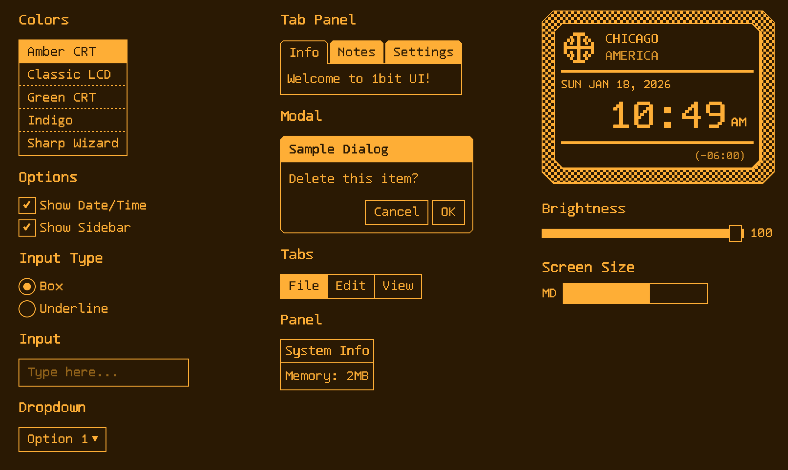

# 1bit UI

A retro 1-bit component library for Svelte 5 — inspired by Palm Pilot, Macintosh, and Game Boy aesthetics.



## What is 1-bit?

1-bit displays can only show 2 colors — no gradients, no anti-aliasing, just pure pixels. Classic devices like the Palm Pilot, original Macintosh, and Game Boy used this constraint, creating a distinctive aesthetic that's both nostalgic and timeless.

This library recreates that aesthetic with:
- **Monospace bitmap fonts** (Tamzen)
- **Dither patterns** for simulated grayscale
- **Chunky borders** and pixel-perfect rendering
- **Light/dark mode** support

## Installation

```bash
npm install 1bit-ui
```

## Usage

```svelte
<script>
  import { Button, Input, Toggle, Modal } from '1bit-ui';
  import '1bit-ui/theme.css';
  
  let darkMode = $state(true);
</script>

<div class:dark={darkMode}>
  <Toggle bind:checked={darkMode} labelOn="Dark" labelOff="Light" />
  <Input placeholder="Enter text..." />
  <Button>Submit</Button>
</div>
```

## Components

### Form Controls
| Component | Description |
|-----------|-------------|
| `Button` | Classic bordered button with hover inversion |
| `Input` | Text input with box or underline variants |
| `Checkbox` | Checkbox with pixel-art checkmark |
| `Radio` | Radio button with filled dot |
| `Toggle` | On/Off segmented toggle |
| `Dropdown` | Select dropdown with keyboard navigation |
| `Slider` | Range slider with custom thumb |

### Layout
| Component | Description |
|-----------|-------------|
| `Panel` | Container with optional title bar |
| `Modal` | Dialog with title bar and footer |
| `Tabs` | Horizontal tab strip |
| `TabPanel` | Tabs with content area |
| `List` | Selectable list with dividers |
| `TitleBar` | Inverted header bar |

### Feedback
| Component | Description |
|-----------|-------------|
| `ProgressBar` | Horizontal progress indicator |

### Device Frame
| Component | Description |
|-----------|-------------|
| `Screen` | PDA device frame with bezel |

## Theme Variables

The library uses CSS custom properties for theming:

```css
:root {
  --1bit-bg: #888869;        /* Light mode background (LCD green) */
  --1bit-fg: #000000;        /* Light mode foreground */
  --1bit-border-width: 2px;  /* Border thickness */
  --1bit-font: 'Tamzen', monospace;
}

.dark {
  --1bit-bg: #000000;        /* Dark mode background */
  --1bit-fg: #888869;        /* Dark mode foreground */
}
```

## Dither Patterns

CSS utility classes for classic dithering effects:

```svelte
<div class="dither-25">25% gray (sparse dots)</div>
<div class="dither-50">50% gray (checkerboard)</div>
<div class="dither-75">75% gray (dense dots)</div>
<div class="dither-bayer">Bayer ordered dither</div>
<div class="dither-hlines">Horizontal lines</div>
<div class="dither-vlines">Vertical lines</div>
<div class="dither-diag">Diagonal lines</div>
<div class="dither-cross">Crosshatch</div>
```

## Development

```bash
# Install dependencies
npm install

# Start dev server
npm run dev

# Build library
npm run package

# Type check
npm run check
```

## Pairs Well With

- [Pixelarticons](https://github.com/halfmage/pixelarticons) — 486 beautiful pixel art icons on a 24x24 grid. Perfect for 1-bit UIs!

## License

MIT

## Credits

- Fonts: [Tamzen](https://github.com/sunaku/tamzen-font)
- Icons: [Pixelarticons](https://github.com/halfmage/pixelarticons) by halfmage
- Inspiration: Palm OS, Classic Mac OS, Game Boy, Sharp Wizard
